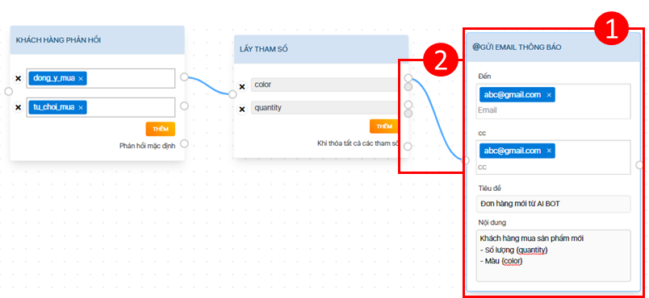
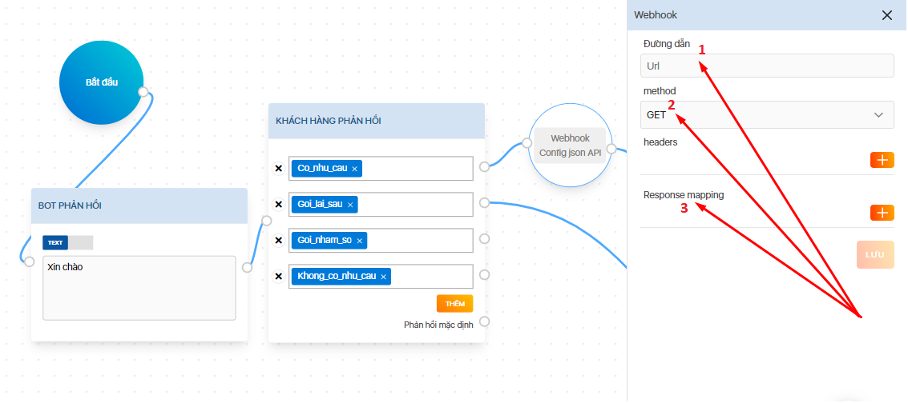
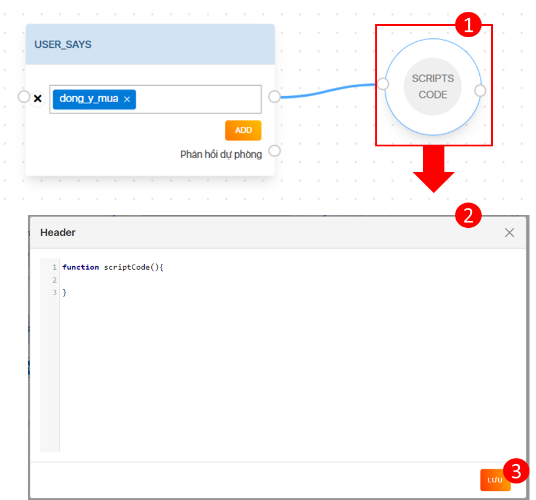
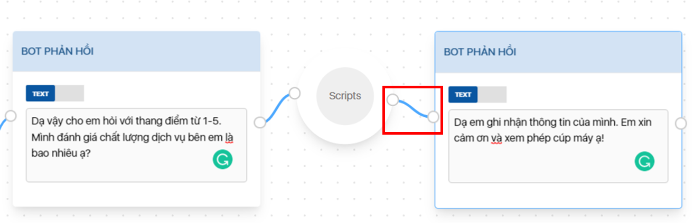

# Kích hoạt

Công cụ cho phép tạo kích hoạt các hành động tương ứng với điều kiện hoặc ý định bất kỳ.

## Email

Kích hoạt gửi thông báo đến địa chỉ email với thông điệp tùy chỉnh.

**Ví dụ**

Khi xuất hiện ý định dong\_y\_mua, AI BOT phản hồi để lấy tham số tương ứng (Số lượng: quantity, màu sắc: color) sau đó gửi email thông báo kèm nội dung và tham số vừa lấy.

**Cách thiết lập**

(1) Kéo thả khối Email vào Canvas & cấu hình gửi mail như hình \[1]

(2) Tạo kết nối đến ý định / điều kiện / khối hành động tương ứng \[2]

## Nhân viên hỗ trợ 

Có thể cài đặt để chuyển hướng cuộc gọi cho nhân viên hỗ trợ như sau:&#x20;

### Tạo danh sách nhân viên

Cần tạo trước danh sách nhân viên hỗ trợ trước khi kích hoạt chuyển hướng cuộc gọi

#### Tạo danh sách phòng ban

(1) Chọn Cài đặt nâng cao -> chọn AI Voicebot -> Chọn Nhân viên hỗ trợ

(2) Chọn Tạo mới

(3) Nhập tên phòng ban (Ví dụ: CSKH - Chăm sóc khách hàng)

(4) Chọn Lưu để hoàn tất

 (1).png>)

#### Thêm nhân viên

(1) Chọn danh sách phòng ban vừa tạo

(2) Tại khung hiển thị, chọn "Thêm"

.png>)

(3) Nhập tên nhân viên và số điện thoại chuyển hướng

(4) Chọn Lưu để hoàn tất

 (1).png>)

### Kích hoạt chuyển hướng cuộc gọi

(1) Kéo thả khối Nhân viên hỗ trợ vào Canvas

(2) Chọn danh sách phòng ban

(3) Tại khung hiển thị, chọn nhân viên cần chuyển hướng cuộc gọi

* Chọn  nếu muốn thêm mới số máy nhánh; chọn  nếu muốn xóa máy nhánh

(4) Chọn Lưu để hoàn tất

.png>)

(5) Tạo kết nối với điều kiện / ý định / khối hành động tương ứng


Nên sử dụng số máy nhánh của tổng đài thay cho số cá nhân để chuyển hướng & hỗ trợ khách hàng hiệu quả hơn


## Webhook 

Webhook cho phép hệ thống truy cập API từ một ứng dụng/hệ thống khác trong thời gian thực, hỗ trợ tích hợp hoặc truy cập công thức tính toán từ dữ liệu thông tin mà khách hàng cung cấp.

Cách thiết lập

(1) Kéo thả khối Webhook vào Canvas

(2) Nhấn chọn khối Webhook để hiển thị giao diện cấu hình

* Nhập đường dẫn truy cập đến API \[1]
* Chọn phương thức truy cập API \[2]
* Response Mapping: Thiết lập ánh xạ giá trị trả về từ API sang biến sau khi xử lý. Sử dụng biến này trong thiết lập phản hồi cho AI BOT. \[3]

(3) Tạo kết nối với điều kiện / ý định / khối hành động tương ứng

## Scripts code 

Kích hoạt chạy các đoạn mã logic phức tạp cho AI BOT trong ngữ cảnh cuộc trò chuyện, để AI BOT thực hiện những nhiệm vụ nâng cao.

**Cách thiết lập**

(1) Kéo thả khối Scripts code vào Canvas \[1]

(2) Nhấn chọn khối Scripts code để hiển thị giao diện cấu hình

(3) Nhập vào đoạn mã Scripts \[2]

(4) Chọn Lưu để hoàn tất \[3]

(4) Tạo kết nối với điều kiện / ý định / khối hành động tương ứng

### &#x20;

