# Tạo phản hồi FAQ

Tính năng phản hồi FAQ giúp AI Bot trả lời các câu hỏi của khách hàng nằm ngoài kịch bản chính, cung cấp thêm thông tin từ bộ tri thức đã được dựng sẵn để linh hoạt trả lời các câu hỏi và giảm thiểu khả năng phản hồi chưa đúng với ý định của khách hàng.&#x20;

Tính năng phản hồi FAQ được áp dụng cho các block [**Khách hàng phản hồi (User Say**](../blocks/luot-hoi-thoai.md)**)** và **Khách hàng phản hồi nâng cao (User says Advanced).**&#x20;

## **Tạo ý định FAQ**

### **Bước 1:** Tạo ý định FAQ

Chọn tab Bối cảnh (TRANG CHỦ / XÂY DỰNG KỊCH BẢN / KỊCH BẢN (V1.0) / BỐI CẢNH), nhấn vào nút TẠO MỚI.

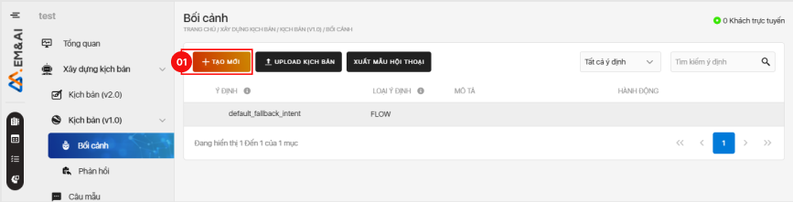

### **Bước 2:** Cài đặt Tạo mới ý định FAQ

1. Từ trang Tạo mới, nhấn vào **Ý định** tại **(02).**
2. Nhấn chọn ô **FAQ** tại **(2.1)**

<figure>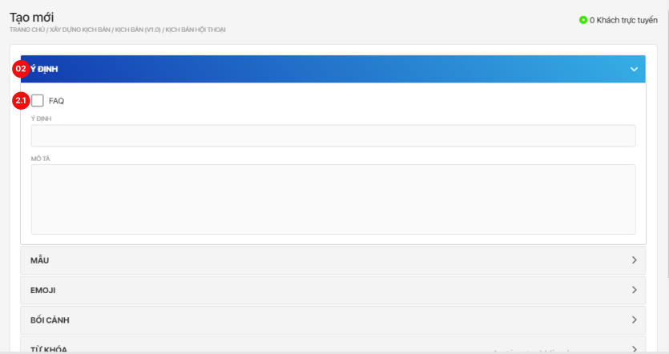<figcaption></figcaption></figure>

1. Nhập tên **Ý định FAQ** tại **(2.2)** để đặt tên ý định FAQ
2. Nhập tên **Tiêu đề nút** tại **(2.3)**
3. Nhấn chọn ô **Quay trở lại flow của ý định này sau khi trả lời một FAQ** tại **(2.4)**_(Không bắt buộc)_
4. Nhập **Mô tả** tại **(2.5)** _(Không bắt buộc)_

<figure>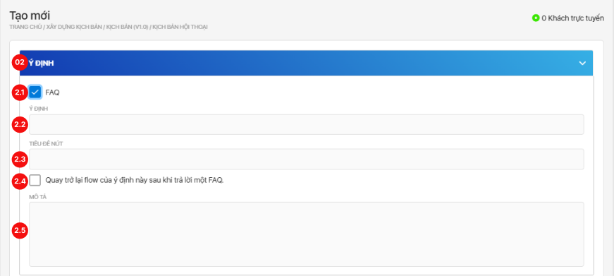<figcaption></figcaption></figure>

5\. Lăn chuột đến cuối trang, nhấn vào nút **LƯU** để lưu ý định FAQ.

### **Bước 3:** Thêm câu mẫu cho ý định FAQ

1. Từ trang Bối cảnh, nhấn vào ý định FAQ cần thêm câu mẫu hoặc nhấn vào biểu tượng **Bút chì.**

<figure>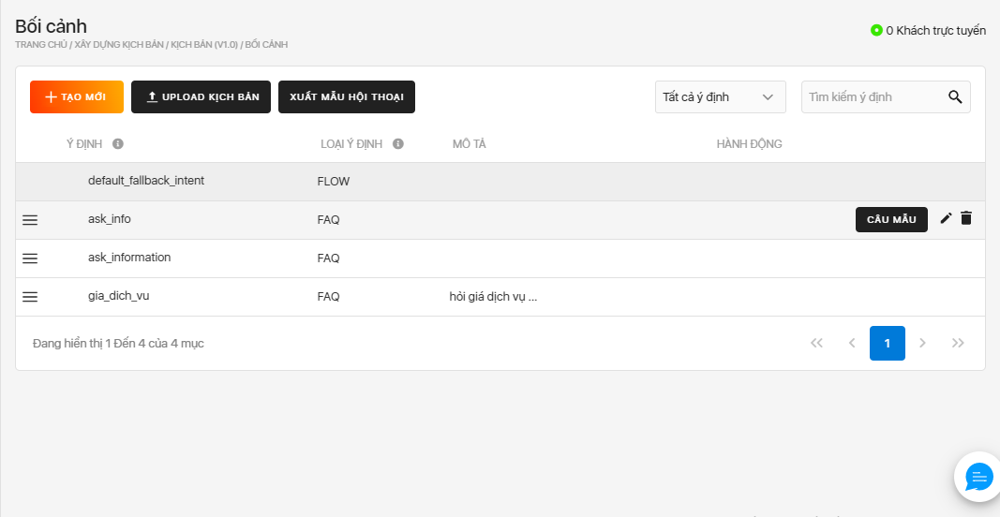<figcaption></figcaption></figure>

2\. Nhấn vào **Mẫu** tại **(03)** để thêm câu mẫu cho ý định FAQ

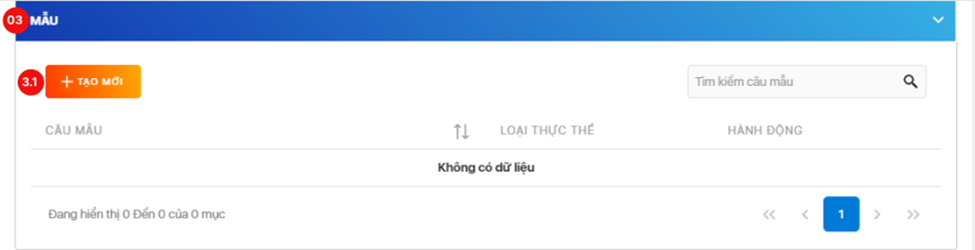

3\. Nhấn vào nút **TẠO MỚI** tại **(3.1)** để tiến hành thêm câu mẫu trên Pop-up **Câu mẫu** như hình dưới.

4\. Nhập nội dung câu mẫu ở ô **Nội dung** tại **(3.2)**

5\. Nhấn chọn thêm ý định cho câu mẫu vừa tạo tại **(3.3)** nếu muốn. _(Không bắt buộc)_

6\. Nhấn nút **LƯU** tại **(3.4)** để lưu câu mẫu.

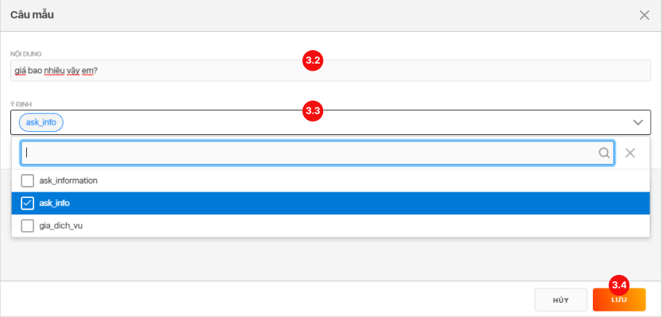

### **Bước 4:** Thêm phản hồi cho ý định FAQ (cấu hình nâng cao)

Mục đích của bước cấu hình này là yêu cầu bot phản hồi tự động khi FAQ được kích hoạt trong đoạn hội thoại. Người dùng có thể thiết lập các phản hồi theo một, hoặc nhiều điều kiện cụ thể, để cấu hình người dùng tham khảo các bước dưới đây:

**Thêm mới một block phản hồi**_(không bắt buộc)_**:**

1. Nhấn vào nút THÊM BLOCK tại **(4.1)**

<figure>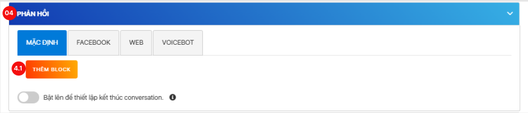<figcaption></figcaption></figure>

2. Nhấn vào mũi tên tại **(4.2)** để đi đến cài đặt chi tiết cho phản hồi

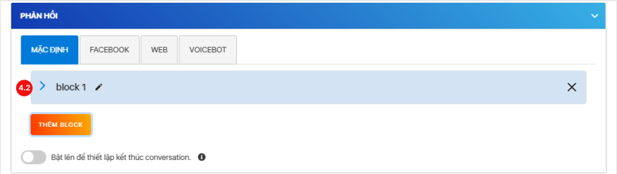

**Thêm điều kiện để kích hoạt block phản hồi** _(không bắt buộc)_**:**

Chọn "Điều kiện", sau đó chọn "Rule" để thêm mới một điều kiện. Ngoài ra người dùng có thể cấu hình điều kiện "Và" & "Hoặc" để kết hợp nhiều điều kiện khác nhau.

<figure>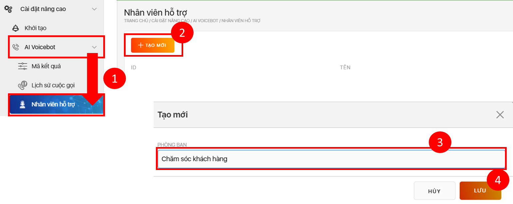<figcaption></figcaption></figure>

**Cấu hình tham số nếu block được kích hoạt** _(không bắt buộc)_**:**

Cho phép người dùng cấu hình tham số và giá trị của tham số bất khi, hệ thống sẽ ghi nhận tham số và giá trị tham số khi block được kích hoạt.

<figure><figcaption></figcaption></figure>

**Thêm phản hồi** _(không bắt buộc)_**:**

Chọn "Thêm mới phản hồi" để tạo mới một phản hồi cho bot, các phản hồi được áp dụng cho FAQ sẽ nằm ở mục "Phản hồi đã chọn". Ngoài ra người dùng cũng có thể sử dụng các phản hồi có sẵn đã được tạo từ trước đó bằng cách kéo từ "Phản hồi có sẵn" sang "Phản hồi đã chọn".

<figure><figcaption></figcaption></figure>

**Lưu ý:** khi người dùng thêm nhiều phản hồi trong mục phản hồi đã chọn, khi FAQ được kích hoạt, hệ thống sẽ phản hồi lần lượt tất cả các phản hồi. Trường hợp người dùng muốn sử dụng nhiều mẫu câu cho một phản hồi thì chọn "Thêm" để thêm nhiều mẫu phản hồi khác nhau.

<figure><figcaption></figcaption></figure>

## **Tạo phản hồi FAQ**

### **Bước 1:** Kích hoạt phản hồi FAQ:

1. Từ thanh công cụ (bên trái), thực hiện kéo, thả khối Khách hàng phản hồi/Khách hàng phản hồi (Nâng cao) vào Canvas.
2. Nhấp chuột vào block, hệ thống sẽ hiển thị thiết lập **Cấu hình chung.** _(Xem hình 1)_

<figure><figcaption></figcaption></figure>

_Hình 1: Bật cài đặt Cấu hình chung - phản hồi FAQ._

### **Bước 2:** Chọn phản hồi FAQ

Tick chọn vào ô **Phản hồi FAQ** tại **(01)** để làm hiện cài đặt Phản hồi FAQ. _(Xem hình 2)_

* Để hủy chọn Phản hồi FAQ, nhấn vào **(1), bộ cài đặt FAQ** tại **(2)** và **(3)** sẽ biến mất.

### **Bước 3:** Tùy chỉnh số lần lặp lại FAQ

* Giới hạn số lần phát FAQ: số lần tối đa mà bot được phép sử dụng FAQ để phản hồi.
* Giới hạn số lần phát một FAQ: số lần tối đa mà bot được phép sử dụng **một FAQ bất kỳ** để phản hồi.

### **Bước 4:** Nhập nội dung hỏi lại

Nhập nội dung hỏi lại tại (&#x34;**)**, số ký tự giới hạn là 1000. _(Xem hình 2)_

* Nếu **để trống** nội dung hỏi lại, bot sẽ trả lời FAQ xong và **không phản hồi nội dung lặp lại** nhưng vẫn tiếp tục đợi khách hàng phản hồi tiếp trong bối cảnh đang diễn ra hội thoại
* Nếu muốn thêm nội dung hỏi lại, vui lòng bấm vào **(5)**. Khi tạo nhiều nội dung hỏi lại khác nhau, các phản hồi này sẽ được **lựa chọn ngẫu nhiên** để phản hồi khách hàng trong cuộc hội thoại thực tế

### **Bước 5:** Lưu cài đặt FAQ

Người dùng bấm vào nút **Lưu** tại **(03)** để lưu cài đặt Phản hồi FAQ. _(Xem hình 2)_

Block nào được Lưu cài đặt Phản hồi FAQ thì sẽ hiện “Phản hồi FAQ” ngay dưới tag chọn ý định.

_(Xem Hình 3)_

<figure>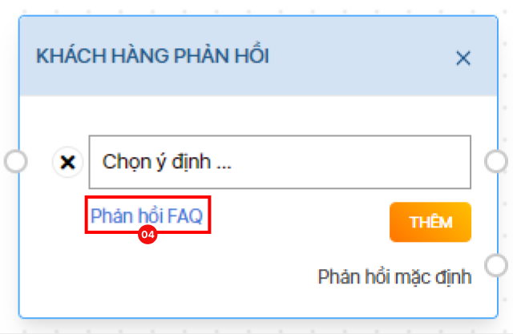<figcaption>
<em>Hình 3: Giao diện của 1 block có cài đặt phản hồi FAQ.</em>
</figcaption></figure>

Để cấu hình luồng ra dữ liệu khi đạt giới hạn FAQ hoặc rơi vào luồng mặc định, người dùng thêm một khối "Điều kiện" nối với phản hồi mặc định và cấu hình như sau:

* **fallbackType = NORMAL:** luồng đi khi số lần phát intent đạt giới hạn
* **fallbackType = FAQ:** luồng đi khi **tổng số lần phát FAQ** đạt giới hạn
* **fallbackType = SINGLE\_FAQ:** luồng đi khi **số lần phát của một FAQ** đạt giới hạn

<figure><figcaption></figcaption></figure>

**Thêm tính năng Copy/ Paste khối cho V2:** Tính năng cho phép người dùng có thể dùng thao tác nhấn tổ hợp phím Ctrl C, Ctrl V để sao chép và dán một khối trong khi thiết kế luồng hội thoại.

Tính năng copy - paste khối hội thoại cho phép người dùng sao chép và dán một khối hội thoại bất kỳ trong phạm vi xây dựng kịch bản V2. Tính năng này nhằm giúp người dùng tiết kiệm thời gian tạo kịch bản và hoàn thiện kịch bản ở tốc độ nhanh hơn.

Tính năng sao chép và dán được áp dụng cho tất cả các khối hội thoại trên kịch bản V2.

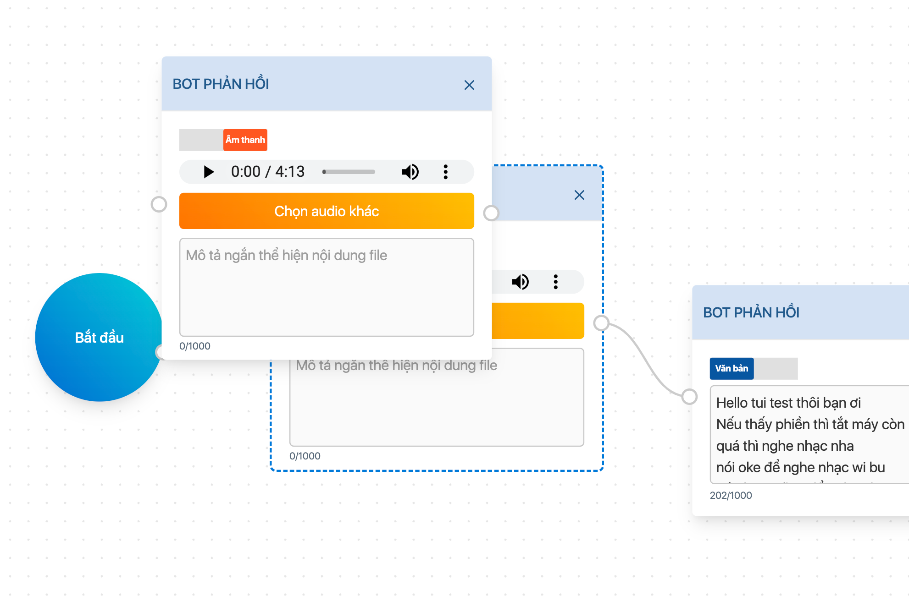
