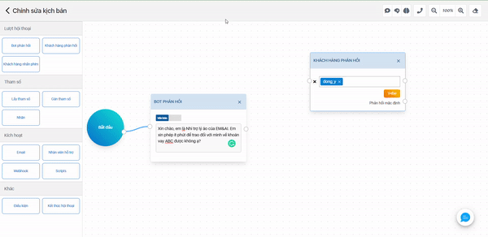

# Conversation flow operations

## Add blocks

Drag and drop blocks from the library (2) into the Canvas space (1)

<figure><figcaption></figcaption></figure>

## Delete all block

### Delete each block

(1) Select the block to delete

(2) Right click

(3) Select the (x) icon or press the “delete” button to delete

<figure><figcaption></figcaption></figure>

### Delete all blocks:

(1) Select button on the NLP toolbar.

(2) Select to confirm the deletion of all blocks in the conversation flow.

## Connect

A connection is a line connecting two blocks to create action navigation and response order in the conversation flow. How to create is as follows.

(1) Add the blocks that need to create connections.

(2) Select the connection point on this block and drag the mouse to the connection point of the other block to create a link between the two blocks.

