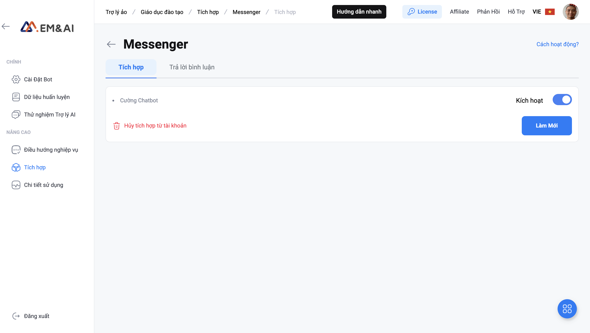

# Tích hợp

**Bước 1:** Hệ thống sẽ hiển thị tab Tích hợp Messenger -> nhấn vào button **Kết nối với Messenger** để tiến hành tích hợp.

<figure><figcaption>
Nhấn vào button <strong>Kết nối với Messenger</strong> để tiến hành tích hợp
</figcaption></figure>

* Chọn tài khoản Facebook để kết nối với VAgent

<figure><figcaption>
Tiếp tục kết nối bằng tài khoản hiện tại hoặc đăng nhập vào tài khoản khác
</figcaption></figure>

**Lưu ý:** tài khoản facebook được chọn, phải là thành viên quản trị của Fanpage cần tích hợp chatbot.

**Bước 2:** Hệ thống sẽ hiển thị các fanpage của tài khoản Facebook đã kết nối, tại đây bạn lựa chọn fanpage cần tích hợp và nhấn **Next (Tiếp theo)**

<figure><figcaption>
Chọn Fanpage cần tích hợp -> nhấn <strong>Next (Tiếp theo)</strong>
</figcaption></figure>

**Bước 3**: Thiết lập quyền truy cập cho VAgent, cho phép Vagent được thực hiện tất cả các tác vụ được liệt kê

* Bật Toggle sang trạng thái **Yes** để cấp quyền truy cập cho Vagent -> Nhấn **Done (Xong)**

**Lưu ý**: EM\&AI VAgent sẽ không thể hoạt động được nếu người dùng không cấp quyền cho các tác vụ này

<figure><figcaption>
Cho phép Virtual Agent quyền truy cập bằng cách nhấn chọn vào toogle <strong>Yes</strong>
</figcaption></figure>

**Bước 4:** Hệ thống hiển thị pop-up Tích hợp Messenger, nhấn Enable (Kích hoạt) -> nhấn Reload. Lúc này bạn đã tích hợp thành công Virtual Agent vào Facebook Messenger. Bạn có thể truy cập Facebook/Messenger vào hội thoại của Fanpage đã tích hợp để kiểm tra.&#x20;

<figure><figcaption>
Nhấn <strong>Enable (Kích hoạt)</strong> -> nhấn <strong>Reload</strong> để hoàn tất tích hợp VAgent vào Facebook Messenger
</figcaption></figure>

Như vậy, các bước tích hợp vào Facebook Messenger đã hoàn tất.

Nếu bạn muốn cài đặt điều kiện trả lời bình luận, nhấn tab [Trả lời bình luận](tra-loi-binh-luan.md)
